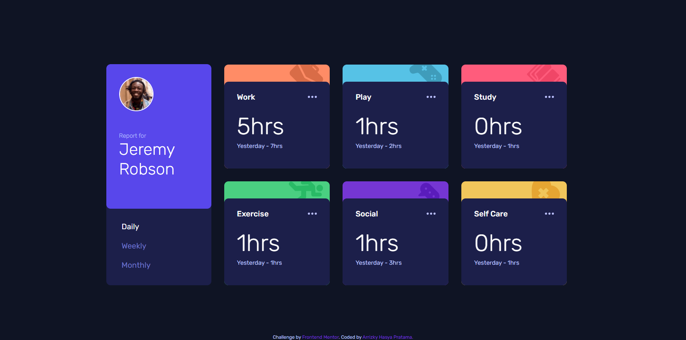

# Frontend Mentor - Time tracking dashboard solution

This is a solution to the [Time tracking dashboard challenge on Frontend Mentor](https://www.frontendmentor.io/challenges/time-tracking-dashboard-UIQ7167Jw). Frontend Mentor challenges help you improve your coding skills by building realistic projects.

## Table of contents

- [Overview](#overview)
  - [The challenge](#the-challenge)
  - [Screenshot](#screenshot)
  - [Links](#links)
- [My process](#my-process)
  - [Built with](#built-with)
  - [What I learned](#what-i-learned)
  - [Useful resources](#useful-resources)
- [Author](#author)

## Overview

### The challenge

Users should be able to:

- View the optimal layout for the site depending on their device's screen size
- See hover states for all interactive elements on the page
- Switch between viewing Daily, Weekly, and Monthly stats

### Screenshot


[📱 Mobile Version](./mobile.png)

### Links

- 📌 Solution URL: [Solution](https://github.com/arrizkyhp/fm-time-tracking-dashboard)
- 🎪 Live Site URL: [Live Site](https://arrizkyhp.github.io/fm-time-tracking-dashboard/)

## My process

### Built with

- CSS custom properties
- Flexbox
- CSS Grid
- BEM naming
- [Sass](https://sass-lang.com/) - CSS extension
- [GulpJS](https://gulpjs.com/) - JS library
- [ReactJS](https://reactjs.org/) - JS library

### What I learned

I learn hook useContext for this challenge, to switch between daily, weekly & monthly menu.

```jsx
// index.jsx

import { createContext, useState } from "react";
export const PeriodContext = createContext({
  period: "weekly",
  setPeriod: () => {},
});

export default function Home() {
  const [period, setPeriod] = useState("weekly");
  const value = { period, setPeriod };

  return (
    <main className="container">
      <PeriodContext.Provider value={value}>
        <CardMenu data={profileData} />

        <Cards />
      </PeriodContext.Provider>
      <Footer />
    </main>
  );
}
```

```jsx
// Card/index.jsx
import { useContext } from "react";
import { PeriodContext } from "pages/Home";

export default function Card( props ) {
    const { period, setPeriod } = useContext(PeriodContext);

    ....

        <div className="card__info">
        <h2 className="info__hours">
            {period === "daily" && `${props.timeframes.daily.current}hrs`}
            {period === "weekly" && `${props.timeframes.weekly.current}hrs`}
            {period === "monthly" && `${props.timeframes.monthly.current}hrs`}
        </h2>
    ....
```

### Useful resources

- [Stackoverflow](https://stackoverflow.com/questions/41030361/how-to-update-react-context-from-inside-a-child-component) - This helped me to switch menu between period (daily, weekly, monthly).
- [Codesandbox](https://codesandbox.io/s/react-context-4c174?file=/src/index.js) - This is codesandbox from stackoverflow above

## Author

- Github - [arrizkyhp](https://github.com/arrizkyhp)
- Frontend Mentor - [@arrizkyhp](https://www.frontendmentor.io/profile/arrizkyhp)
- Twitter - [@arrizkyhp](https://twitter.com/arrizkyhp)
